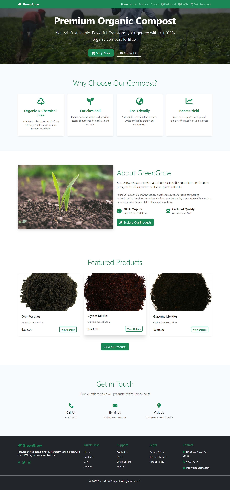
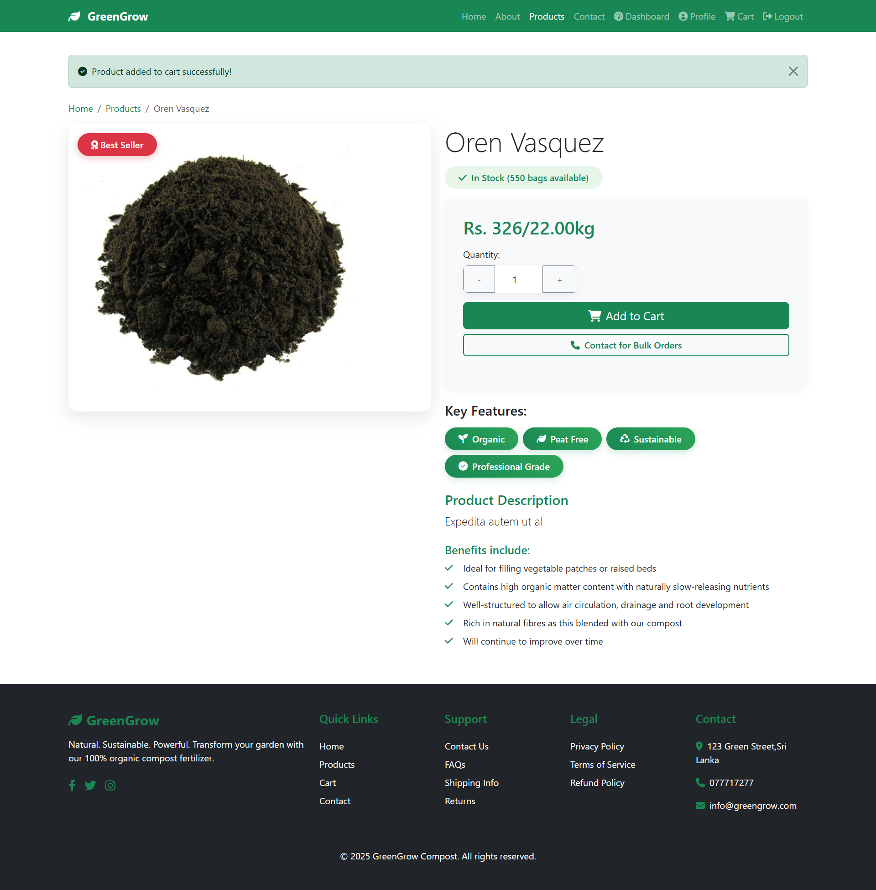
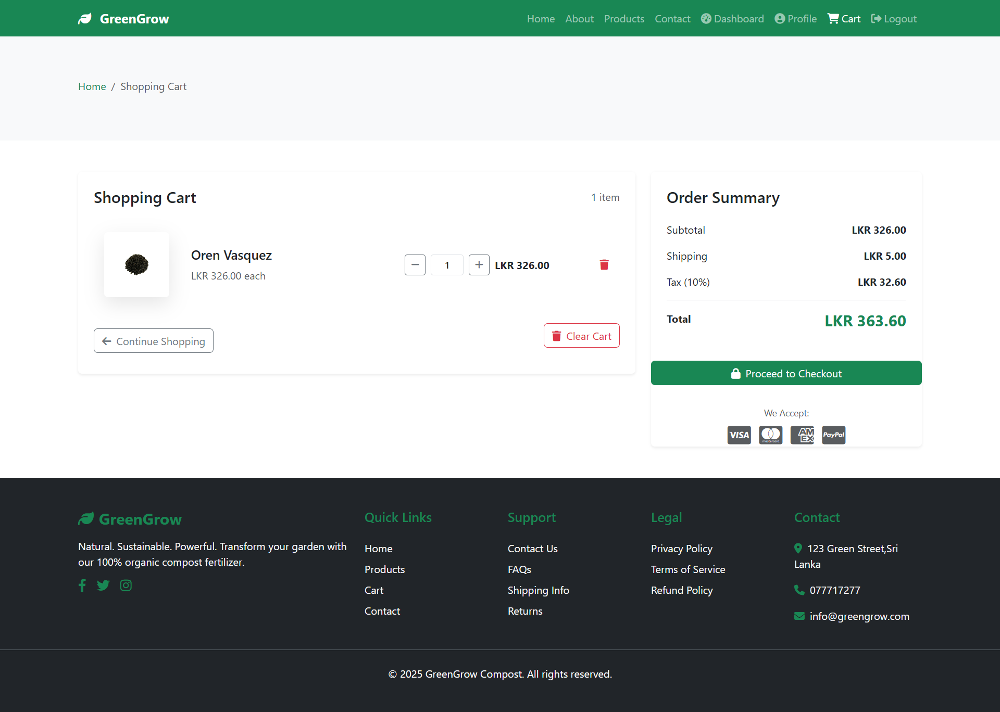
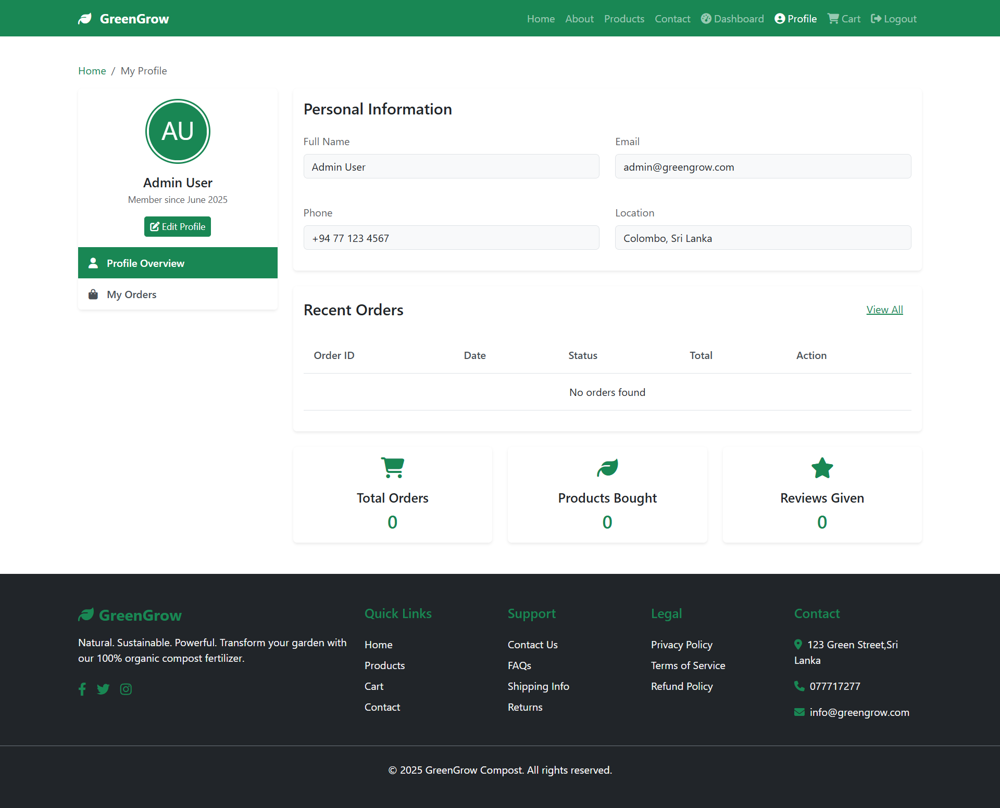
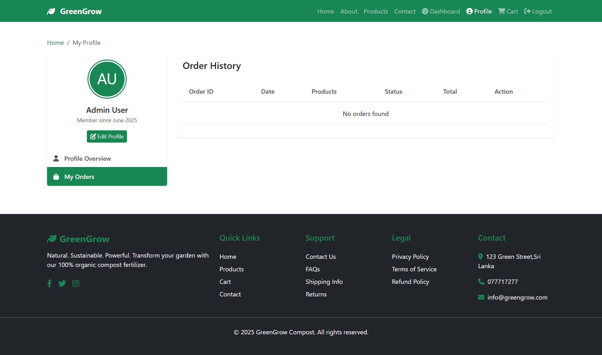
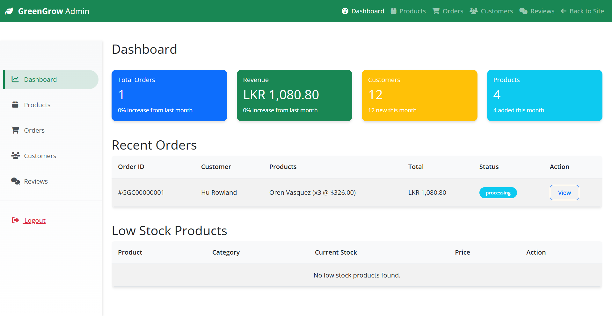
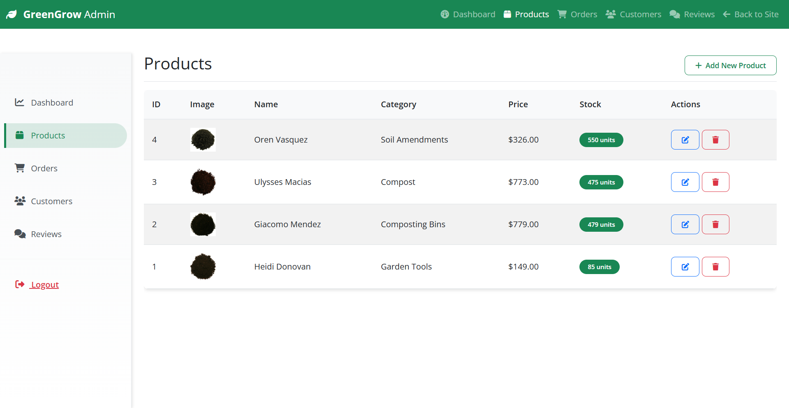
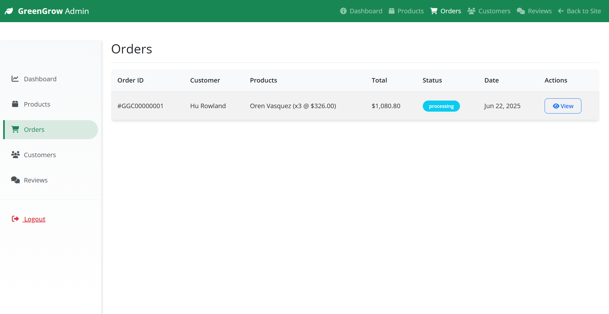

# GreenGrow Compost - Organic Fertilizer E-Commerce Platform

GreenGrow Compost is a modern e-commerce platform specializing in organic fertilizers and composting products. Built with Laravel and featuring a responsive design, it provides a seamless shopping experience for customers looking for sustainable gardening solutions.



## Features

### Customer Features

-   **Product Browsing & Search**

    -   Browse through a wide range of organic fertilizers
    -   Filter products by categories
    -   Search functionality for quick product discovery
    -   Detailed product information with images

    

-   **Shopping Cart & Checkout**

    -   Easy-to-use shopping cart
    -   Real-time price calculations
    -   Multiple payment options
    -   Secure checkout process

    

-   **User Account Management**

    -   Personal profile customization
    -   Multiple shipping addresses
    -   Order history tracking
    -   Product reviews and ratings

    

-   **Order Management**

    -   Real-time order tracking
    -   Order history with detailed views
    -   Digital invoices
    -   Email notifications

    

### Admin Features

-   **Dashboard Analytics**

    -   Sales overview and statistics
    -   Recent orders monitoring
    -   Stock level alerts
    -   Customer activity tracking

    

-   **Product Management**

    -   Product CRUD operations
    -   Category management
    -   Stock control
    -   Price management

    

-   **Order Processing**

    -   Order status management
    -   Customer communication
    -   Invoice generation
    -   Shipping management

    

## Technology Stack

-   **Backend Framework:** Laravel 10
-   **Frontend:**
    -   Blade Templates
    -   TailwindCSS
    -   Alpine.js
-   **Database:** MySQL
-   **Authentication:** Laravel Breeze
-   **File Storage:** Laravel Storage
-   **Payment Integration:** Stripe (ready for integration)

## Installation

1. Clone the repository:

```bash
git clone [repository-url]
cd greenGrowCompost
```

2. Install PHP dependencies:

```bash
composer install
```

3. Install NPM dependencies:

```bash
npm install
```

4. Setup environment file:

```bash
cp .env.example .env
php artisan key:generate
```

5. Configure database in `.env`:

```env
DB_CONNECTION=mysql
DB_HOST=127.0.0.1
DB_PORT=3306
DB_DATABASE=greenGrowCompost
DB_USERNAME=your_username
DB_PASSWORD=your_password
```

6. Run migrations and seeders:

```bash
php artisan migrate --seed
```

7. Create storage link:

```bash
php artisan storage:link
```

8. Build assets:

```bash
npm run build
```

9. Start the server:

```bash
php artisan serve
```

## Usage

### Customer Portal

-   Visit `http://localhost:8000`
-   Register a new account or login
-   Browse products and add to cart
-   Complete checkout process

### Admin Dashboard

-   Access admin panel at `http://localhost:8000/admin`
-   Default admin credentials:
    -   Email: admin@example.com
    -   Password: password
-   Manage products, orders, and customers

## Database Structure

The system includes the following main models:

-   Users (customers and admins)
-   Products
-   Categories
-   Orders
-   Order Items
-   Addresses
-   Reviews

## Security Features

-   CSRF Protection
-   SQL Injection Prevention
-   XSS Protection
-   Secure Password Hashing
-   Role-based Access Control

## Contributing

1. Fork the project
2. Create your feature branch (`git checkout -b feature/AmazingFeature`)
3. Commit changes (`git commit -m 'Add AmazingFeature'`)
4. Push to branch (`git push origin feature/AmazingFeature`)
5. Open a Pull Request

## License

This project is licensed under the MIT License - see the [LICENSE](LICENSE) file for details.

## Support

For support, email support@greengrow.lk or create an issue in the repository.

---

Built with ❤️ by GreenGrow Team
